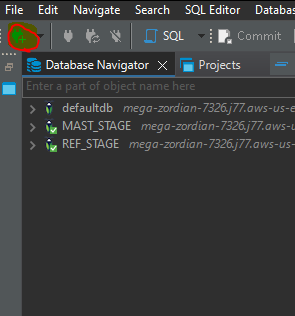
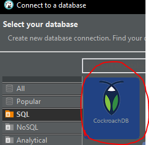
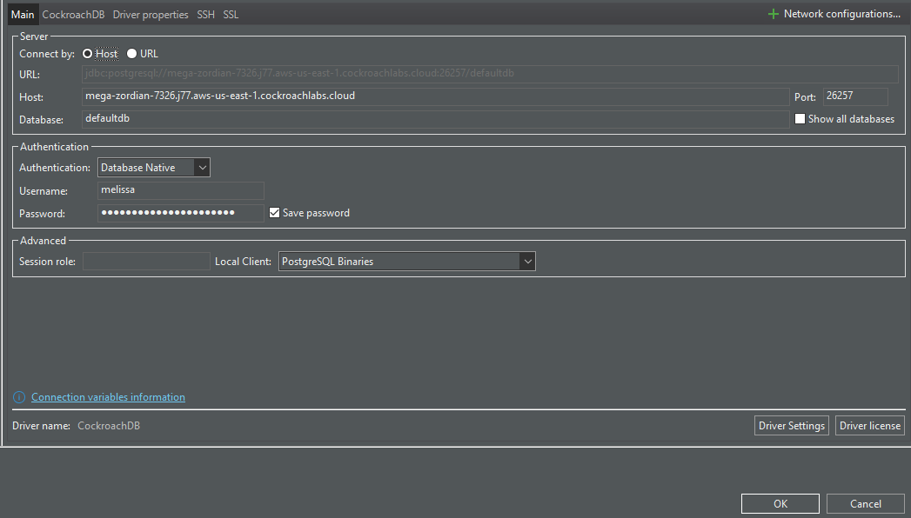
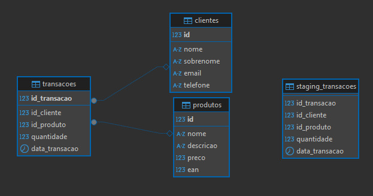
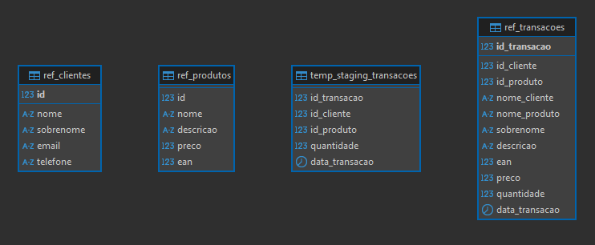
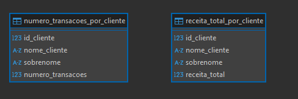

# Projeto Exemplo pipeline Airflow

Esse projeto utiliza pipelines airflow para gerar tabelas.

## Dependencias
- [Astronomer](https://www.astronomer.io/docs/astro/cli/get-started-cli/)
- [DBeaver](https://dbeaver.io/)
- [Docker](https://www.docker.com/)
- [WSL](https://learn.microsoft.com/pt-br/windows/wsl/install)

## Antes de começar

Instale o WSL na maquina via powershell se o host for windows.
Baixe com o comando wsl --install -d ubunto ou outra distribuição.

Configure e instale o docker, após isso é necessario ir na pasta C: (root) e criar e atualizar um arquivo chamado: .wslconfig
Aumente a memoria para minimo 4gb exemplo:

[wsl2]
memory=4GB

Isso permite que o airflow consiga gerar o schedule.

Instale o Astro Cli via cmd:
winget install -e --id Astronomer.Astro

Astronomer facilita a criação e configuração de um ambiente de airflow de forma mais rapida e facil.

### Começando

Abra o git e clone este repositorio.
https://github.com/Melissa-G-V/DataMart_Megazord.git

Vá na pasta chamada Airflow e abra o cmd:
Esse comando começa astronomer na porta 8080

    astro dev start

Abra o vscode

    code .

- Usuario: admin
- Senha: admin

Todas as dags devem estar prontas para serem rodadas.

Agora para observar os resultados abra o DBEAVER:

Abra uma nova conexão:

Selecione CockroachDB:

Conforme a imagem abaixo configure:

- HOST: mega-zordian-7326.j77.aws-us-east-1.cockroachlabs.cloud
- USER: megazorders
- PASSWORD: JBQROkforHRxPkyN2-3LeQ
- PORTA: 26257

BANCOS:

- RAW: defaultdb
- REF: Refined_stage
- MASTER: Master_stage

Utilização do cockroachdb, esse banco foi selecionado para que o avaliador consiga acessar todos os dados via uma ferramenta de gerenciamento de banco de forma facilitada.

A separação dos dados em camadas:

RAW o dado cru como veio da fonte, esta fonte se encontra na pasta airflow/rawdata.

Nesse estagio foi contruido uma tabela de staging, esta tabela pertence a tabela de transações, porque foi gerada? nos dados do cliente como nos do produtos é perceptivel que existem ids que não são encontrados na tabela de transações então foi realizado uma separação para manter o dado original como (ints sem FK), e outro para manter o dado com os PK e FK inteiros. 

Toda a solução foi baseada na tabela qual temos os dados FK id_produtos e id_clientes.

Apatir desses dados é gerado para a tabela refinada as alterações pedidas, nelas se usam o pandas para gerar o dataframe atualizado e é subido no banco de REF (refinamento).

Por fim a ultima tabela é gerada no banco MASTER.

